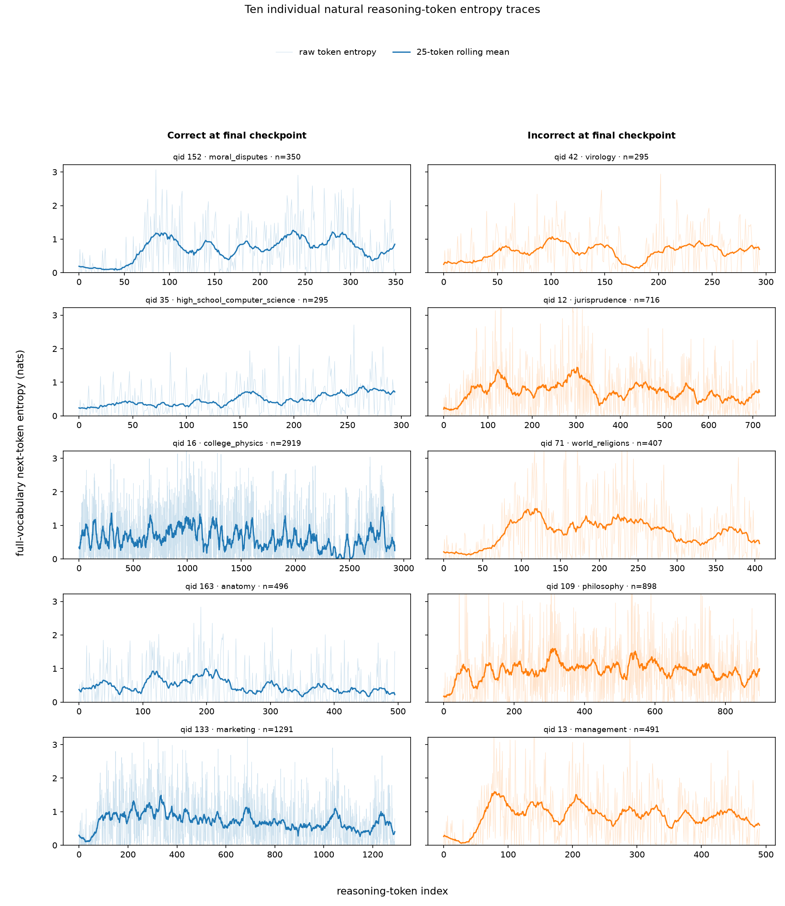
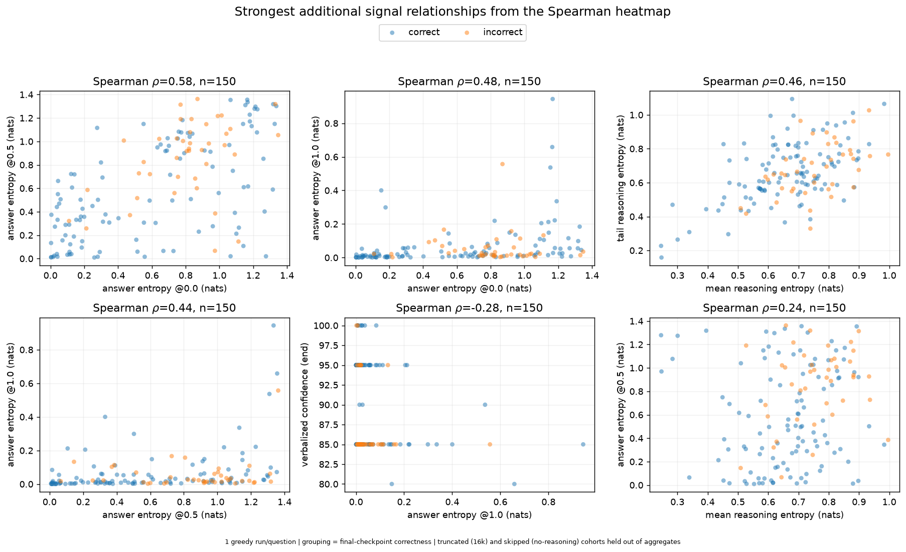
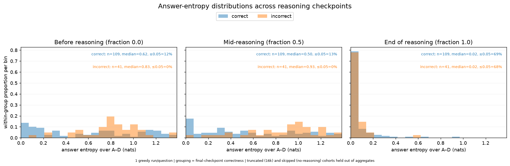

# Professor meeting notes — uncertainty analysis

## Experiment context

- This analysis uses one greedy reasoning chain per question.
- The run contains 200 MMLU questions: 150 closed reasoning normally, 26 reached
  the 16k-token limit, and 24 produced no usable reasoning chain.
- Correctness comparisons below use the 150 closed questions with a final
  answer: 109 correct and 41 incorrect.

## 1. More reasoning chains per question — not completed

Talking points:

- The current pipeline generates one deterministic greedy chain for each
  question. This means we cannot measure how much the reasoning or uncertainty
  changes across repeated attempts at the same question.
- This requires a pipeline change: generate several sampled chains per question,
  save a run identifier for each chain, and aggregate the metrics at both the
  chain and question level.
- This should be the next scaling experiment after deciding how many chains and
  what sampling settings to use.

## 2. Measure `H_ans_*` before and after `</think>` — not completed

Talking points:

- This also requires a generation/checkpoint pipeline change.
- We should first clarify exactly which comparison we want:
  1. Full-vocabulary next-token entropy immediately before and after the natural
     `</think>` token.
  2. Entropy over answer choices A–D after inserting `</think>` at an
     intermediate reasoning prefix.
- The second version is especially relevant to early exiting: close the
  reasoning at several points, ask for the answer, and measure whether answer
  entropy drops after the forced close.
- These measurements should not be mixed with natural reasoning-token entropy;
  they answer different questions.

## 3. Is the early-rise entropy trajectory normal? — completed

Talking points:

- The average natural next-token entropy starts low, rises early in the
  reasoning chain, and then grows more slowly or plateaus.
- Related work reports compatible patterns. High-entropy tokens often occur at
  reasoning forks or decision points, and unstable reasoning can contain
  repeated entropy spikes.
- One simple explanation for the low starting entropy is predictable
  boilerplate such as “We need to determine...” Substantive reasoning gives the
  model more plausible next-token choices.
- This is a credible empirical trend, but it is not a universal law. Individual
  questions are much noisier than the average curve.
- Natural next-token entropy is also different from answer entropy. A model can
  be uncertain about its next word while already leaning strongly toward one
  final answer.

Relevant work:

- [Beyond the 80/20 Rule](https://papers.nips.cc/paper_files/paper/2025/hash/a797c2d2e0c1fdabf4d1ab8cd0b465c6-Abstract-Conference.html)
- [EDIS: Diagnosing LLM Reasoning via Entropy Dynamics](https://arxiv.org/abs/2602.01288)
- [Explore Briefly, Then Decide](https://arxiv.org/abs/2510.02249)
- [ETR: Entropy Trend Reward](https://aclanthology.org/2026.acl-long.799.pdf)

## 4. What exactly is AUROC? — completed

Talking points:

- We have 109 correct and 41 incorrect questions, giving
  `109 × 41 = 4,469` correct–incorrect pairs.
- For each uncertainty signal, orient the score so that a higher value is
  supposed to predict correctness. Confidence is used directly, while entropy
  is negated because lower entropy is expected to predict correctness.
- Compare the score of the correct question with the score of the incorrect
  question in every pair:
  - Add 1 when the correct question has the better score.
  - Add 0.5 when the scores are tied.
  - Add 0 when the incorrect question has the better score.
- Divide the total by 4,469:

  `AUROC = [wins + 0.5 × ties] / (109 × 41)`

- This is the normalized Mann–Whitney U statistic, which is equivalent to the
  Wilcoxon rank-sum interpretation of AUROC.
- For example, an AUROC of 0.689 means there is a 68.9% chance that a randomly
  chosen correct question receives a better oriented score than a randomly
  chosen incorrect question.
- AUROC 0.5 is chance ranking, 1.0 is perfect ranking, and below 0.5 means the
  score is oriented in the wrong direction.

## 5. Humanities and social-science questions — completed initial investigation

Talking points:

- Humanities and social-science subjects appear frequently among the 24 missing
  and 26 truncated chains, especially law, history, psychology, moral reasoning,
  philosophy, and sociology.
- The problem is not exclusive to those subjects. Truncated questions also
  include chemistry, economics, medicine, accounting, electrical engineering,
  and formal logic.
- Long passages may use more of the context and generation budget, but subject
  area alone does not explain every failure.
- Several 16k-token chains end with extremely low-entropy repetition. This
  suggests that raising the token limit alone may allow a loop to continue
  rather than produce a better answer.
- A larger subject-balanced sample, multiple chains per question, prompt-length
  measurements, and separate inspection of repetition loops would support a
  stronger conclusion.

## 6. Plot ten individual reasoning-token entropy traces — completed

Talking points:

- The plot contains five correct and five incorrect questions, selected
  reproducibly and with different subjects where possible.
- Many traces show low entropy at the beginning followed by an increase, which
  agrees with the average trajectory.
- Individual traces contain many sharp spikes and are much less smooth than the
  aggregate curve.
- Correct and incorrect questions visibly overlap. There is no simple trajectory
  shape that cleanly separates them in these ten examples.
- The average early rise is therefore a population-level tendency, not a rule
  that every question follows.

## 7. Add scatter plots for correlated signals — completed

Talking points:

- The strongest additional Spearman relationships were:
  - Answer entropy at 0.0 vs 0.5: `ρ = 0.585`
  - Answer entropy at 0.0 vs 1.0: `ρ = 0.476`
  - Mean vs tail reasoning entropy: `ρ = 0.463`
  - Answer entropy at 0.5 vs 1.0: `ρ = 0.436`
  - Endpoint answer entropy vs verbalized confidence: `ρ = -0.277`
  - Mean reasoning entropy vs answer entropy at 0.5: `ρ = 0.240`
- Answer entropy shows moderate persistence across checkpoints.
- Mean and tail reasoning entropy are related, but reasoning-token entropy and
  answer entropy are not interchangeable signals.
- Correct and incorrect points overlap substantially. Correlation between two
  signals does not mean that either signal perfectly predicts correctness, and
  it does not establish causation.

## 8. Plot histograms of `H_ans_*` — completed

Talking points:

- Before reasoning, median answer entropy is lower for correct questions:
  `0.62` vs `0.83` nats.
- At the middle checkpoint, the difference is larger:
  `0.50` vs `0.93` nats.
- At the final checkpoint, both groups have a median near `0.02` nats.
- Near-zero final answer entropy occurs for 69% of correct questions and 68% of
  incorrect questions.
- The model often becomes highly certain by the endpoint even when its answer is
  wrong. Intermediate answer entropy is therefore more informative about
  correctness than endpoint answer entropy in this run.

## Short overall summary

The completed analyses suggest that uncertainty is most useful during the
reasoning process, especially at intermediate checkpoints. By the end, the
model is usually highly confident regardless of correctness. The two main
unfinished experiments are generating multiple reasoning chains per question
and measuring answer entropy around an explicit `</think>` boundary.
